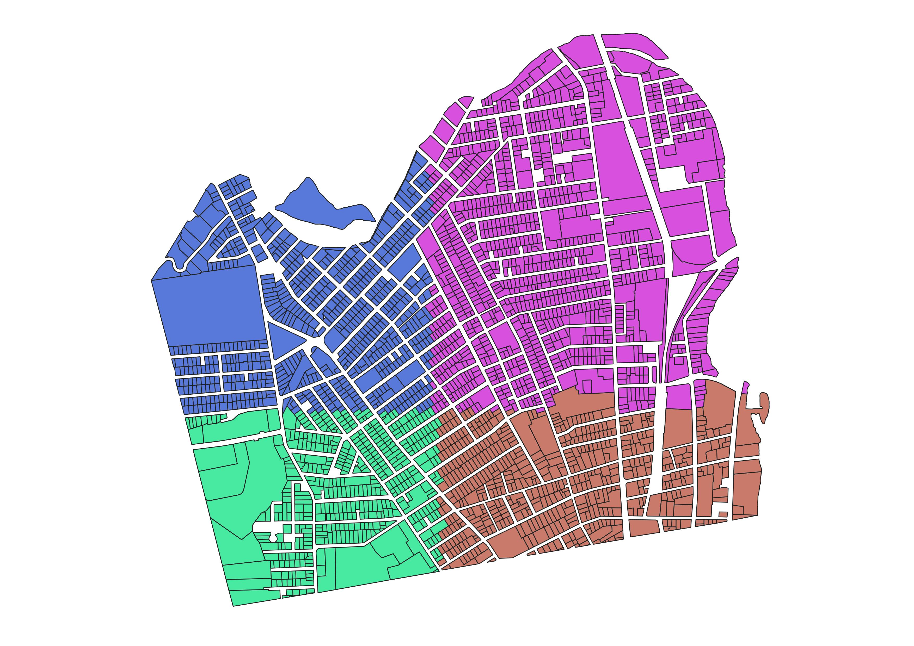
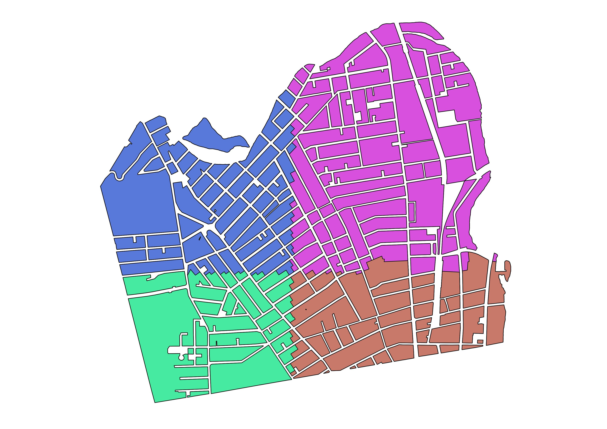
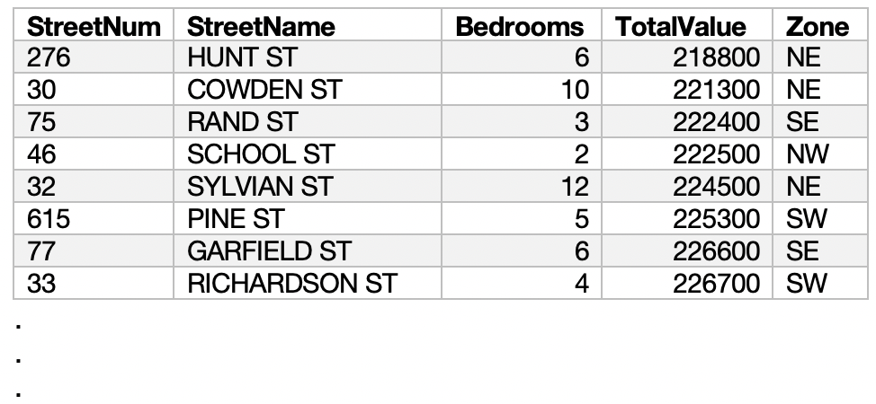
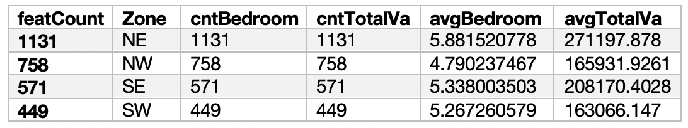
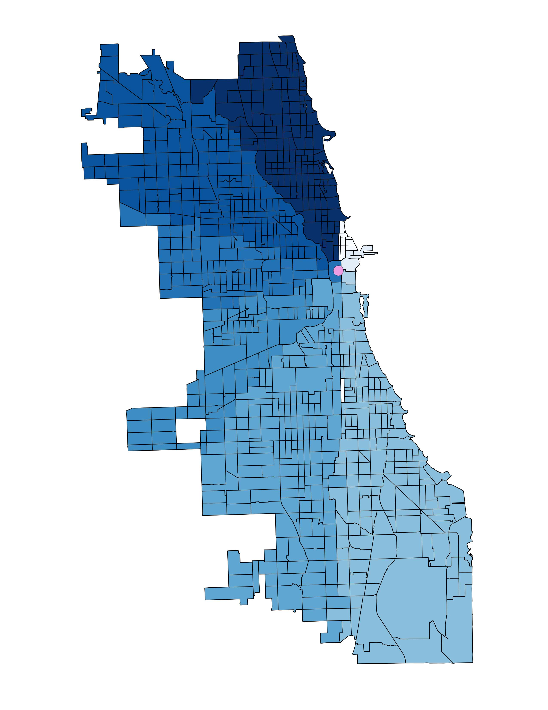
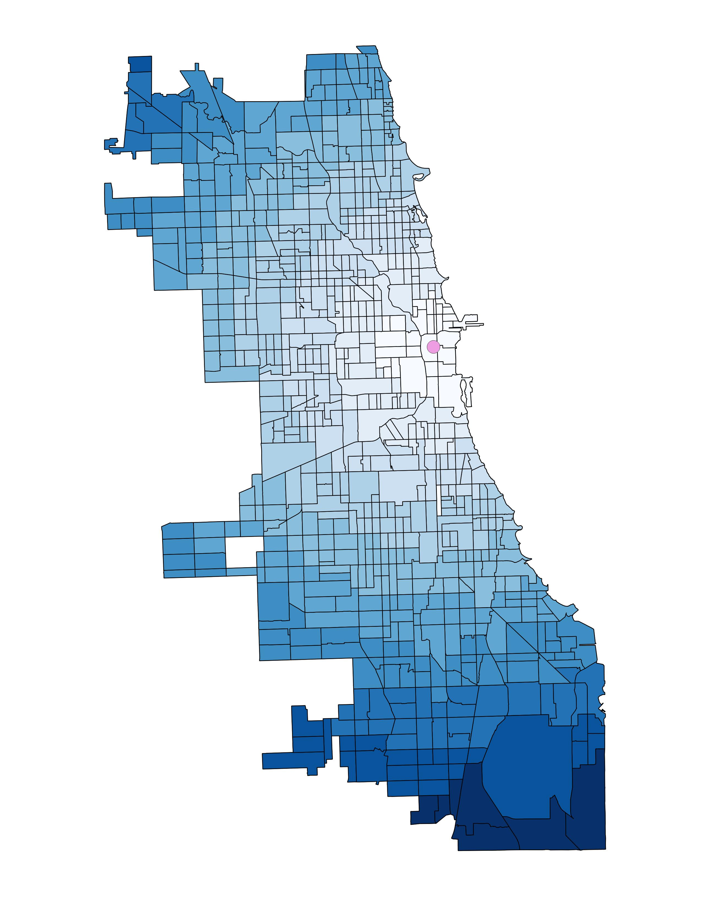
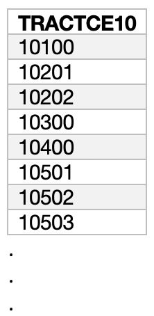
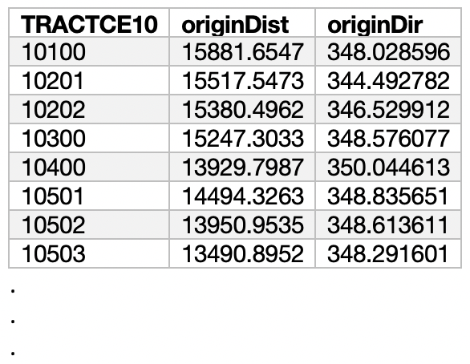

# MiMiGIS (Middlebury Minimal GIS)
 This QGIS plugin, designed for use in introductory GIS courses, contains a Group By tool and a Direction and Distance tool, as well as installation of a set of Mapbox Maki icons and National Park Service (NPS) icons. The plugin was developed and tested using QGIS 3.10.9; compatibility with older versions is not guaranteed.

 The Group By and Distance and Direction algorithms were written by Maja Cannavo and Joseph Holler, and the plugin was built by Maja Cannavo using [Plugin Builder](https://github.com/g-sherman/Qgis-Plugin-Builder).
 The Maki icons were downloaded [here](https://labs.mapbox.com/maki-icons/) from Mapbox, and the NPS icons were downloaded [here](https://www.nps.gov/carto/app/#!/maps/symbols) from NPS. Both sets of icons were then edited by Joseph Holler to allow for color customization in QGIS.

This QGIS plugin, designed for use in introductory GIS courses, contains a Group By tool and a Direction and Distance tool, as well as installation of a set of Mapbox Maki icons and National Park Service icons. We plan to expand the functionality of this plugin over time with more tools and resources. For more information about the project, check out our blog posts [here](https://majacannavo.github.io/jterm21main) and [here](https://www.josephholler.com/a-minimal-gis-plugin-for-qgis/).

Authors: [Maja Cannavo](mailto:mcannavo@middlebury.edu) and [Joseph Holler](mailto:josephh@middlebury.edu), Middlebury College, Middlebury, VT

Plugin/algorithm icons--all under CC0 license from SVG Repo:
[M icon](https://www.svgrepo.com/svg/5274/medium-size), [sigma icon](https://www.svgrepo.com/svg/175093/sigma-maths), [compass rose icon](https://www.svgrepo.com/svg/253234/wind-rose-compass)

## Group By:
Group features with common values in the group field(s). Optionally, dissolve geometries and calculate summary statistics for numeric fields.

### Example: Grouping parcels in Central Falls, RI, by zone (NE, NW, SE, or SW) and calculating count and sum for number of bedrooms and total value.
Example Input | Example Output
--- | ---
 | 
 | 

### Algorithm Parameters:
Parameter | Description | Data Type | Python Identifier
--- | --- | --- | ---
Input layer | Input layer with features to be dissolved. | Vector | 'INPUT'
Group Fields (optional) | In which field(s) do you want to search for values with which to form the new groups? A new group will be formed for each combination of values in the group field(s). If you do not select any group fields, the output will be a single feature. | Field(s) | 'GROUPFIELDS'
Summary Fields (optional) | Which numerical field(s) do you want to calculate summary statistics for? | Numerical field(s) | 'SUMMARYFIELDS'
Dissolve Geometry | Do you want to dissolve the geometries (geographic data) associated with the features? Disjoint geometries are still dissolved into multi-part features. If this option is unchecked, the output will be a table with no geographic data. | Boolean | 'DISSOLVEGEOMETRY'
Average | Calculate the average or mean of your summary field(s)? | Boolean | 'AVERAGE'
Count Values | Count non-null values in your summary field(s)? | Boolean | 'COUNTVALUES'
Sum | Calculate the sum of your summary field(s)? | Boolean | 'SUM'
Maximum | Calculate the maximum of your summary field(s)? | Boolean | 'MAXIMUM'
Minimum | Calculate the minimum of your summary field(s)? | Boolean | 'MINIMUM'
Grouped Output | Grouped output. If you are not dissolving geometries, then save the output as a .csv, .xlsx, or database table. | Feature Sink | 'OUTPUT'       

## Direction and Distance:
Calculates the distance (in meters) and direction (in degrees) from an origin to a set of input features.

### Example: Calculating direction and distance from Chicago's central business district to each of the city's census tracts.
Example Direction Result | Example Distance Result
--- | ---
 | 
Example Input Attribute Table | Example Output Attribute Table
 | 

### Algorithm Parameters:
Parameter | Description | Data Type | Python Identifier
--- | --- | --- | ---
Input Layer | Layer of features for which to calculate direction and distance from the origin. | Vector | 'INPUT'
Origin | Origin feature from which to calculate direction and distance. | Vector | 'ORIGIN'
Prefix | The algorithm creates two new fields, one with suffix 'Dist' for Distance and one with suffix 'Dir' for Direction. Enter a prefix to use for the field names, such that you will not create duplicate fields in your output. | String | 'PREFIX'
Dir/Dist Output | New layer with direction and distance fields. | Feature Sink | 'OUTPUT'
